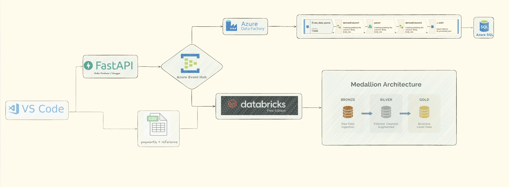
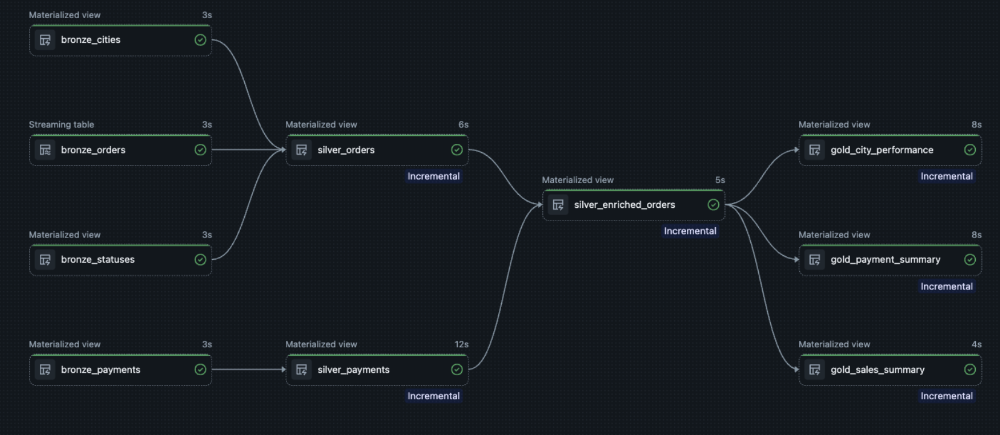

# Azure Databricks E-Commerce Pipeline

An end-to-end modern data engineering project that combines **event-driven ingestion**, **Azure Data Factory transformation**, **Azure SQL serving**, and a **Databricks Medallion Architecture** for analytics.

This project simulates an e-commerce order stream using **FastAPI**, publishes events to **Azure Event Hubs**, processes the same event stream through **two parallel analytical paths**, and produces curated business-ready datasets in **Databricks Free Edition**.

---

## Project Overview

The project was designed to demonstrate how a single event stream can feed multiple downstream systems for different business needs:

* **Operational / ingestion path** using **Azure Data Factory** and **Azure SQL**
* **Analytical path** using **Databricks Lakeflow Pipelines** and a **Bronze / Silver / Gold** model
* **Supplementary synthetic payment and reference datasets** generated locally and uploaded to Databricks for enrichment and advanced analytics

This architecture reflects a realistic hybrid scenario where:

* some data arrives as **real-time streaming events**,
* some datasets are **manually prepared or batch-generated**,
* and analytics are built through a layered transformation model.

---

## Architecture

### High-Level Architecture



### Databricks Pipeline Lineage



---

## End-to-End Flow

### 1. Event generation with FastAPI

A local **FastAPI** service simulates incoming e-commerce orders.

Each request generates an order payload such as:

* `order_id`
* `customer_name`
* `city_id`
* `status_id`
* `order_value`
* `timestamp`

These events are published to **Azure Event Hubs**.

### 2. Azure path: ADF → Azure SQL

The same order events are consumed by **Azure Data Factory**, where dataflow steps parse and transform raw JSON payloads before loading the cleaned result into **Azure SQL**.

This path demonstrates:

* event ingestion from Azure Event Hubs
* parsing and normalization in ADF Data Flow
* operational persistence in Azure SQL

### 3. Databricks path: Event Hubs Kafka endpoint → Bronze

In parallel, **Databricks Free Edition** consumes the order stream using the **Azure Event Hubs Kafka-compatible endpoint**.

Orders land in the **Bronze layer** as raw streaming data.

### 4. Local synthetic payment + reference data

To enrich the analytics model and keep costs low during experimentation:

* `payments_generated.csv` was generated locally
* `map_cities.csv` and `map_statuses.csv` were prepared as reference datasets
* these CSV files were uploaded manually into a Databricks volume

This adds a second source to the analytical model without forcing additional Azure streaming cost.

### 5. Silver layer transformations

Bronze datasets are cleaned, standardized, and enriched in the Silver layer.

### 6. Gold layer aggregations

Gold tables expose business-level summaries such as:

* total sales KPIs
* payment method summaries
* city-level performance metrics

---

## Medallion Architecture

The analytical model follows the **Medallion Architecture**:

### Bronze

Raw ingestion layer.

Tables:

* `bronze_orders` → streaming orders from Azure Event Hubs
* `bronze_payments` → uploaded synthetic payment dataset
* `bronze_cities` → reference city mapping
* `bronze_statuses` → reference status mapping

### Silver

Cleaned and enriched analytical layer.

Tables:

* `silver_orders` → orders enriched with city and status descriptions
* `silver_payments` → payment records standardized for analytics
* `silver_enriched_orders` → unified order + payment model

### Gold

Business-facing aggregated layer.

Tables:

* `gold_sales_summary` → overall order and revenue KPIs
* `gold_payment_summary` → payment method and payment status breakdown
* `gold_city_performance` → city-based order and revenue performance

---

## Repository Structure

```text
azure-databricks-ecommerce-pipeline/
├── Code_Files/
│   ├── api.py
│   ├── data_generator.py
│   └── payment_generator.py
├── Data/
│   ├── map_cities.csv
│   ├── map_statuses.csv
│   ├── orders_clean.csv
│   └── payments_generated.csv
├── databricks/
│   └── transformations/
│       ├── bronze/
│       │   ├── bronze_orders.py
│       │   ├── bronze_payments.py
│       │   └── bronze_reference.py
│       ├── silver/
│       │   ├── silver_orders.py
│       │   ├── silver_payments.py
│       │   └── silver_enriched_orders.py
│       ├── gold/
│       │   ├── gold_sales_summary.py
│       │   ├── gold_payment_summary.py
│       │   └── gold_city_performance.py
│       └── utilities/
│           └── utils.py
└── .gitignore
```

---

## Technologies Used

### Data Ingestion & APIs

* FastAPI
* Azure Event Hubs

### Data Processing

* Azure Data Factory
* Azure SQL
* Databricks Free Edition
* PySpark
* Lakeflow Pipelines

### Data Modeling

* Medallion Architecture
* Incremental transformations
* Reference data enrichment
* KPI aggregation

### Local Development

* Python
* Pandas
* VS Code

---

## Datasets Used

### Streaming dataset

**Orders** are generated through FastAPI and published into Azure Event Hubs.

### Locally generated batch dataset

**Payments** are generated locally to simulate a second business source and support more advanced analytical joins.

### Reference datasets

* city map
* order status map

This setup intentionally combines:

* streaming data
* batch data
* reference/master data

which makes the project closer to a real production analytics environment.

---

## Example Analytical Outputs

### Sales Summary

The Gold layer provides overall KPIs such as:

* total orders
* total revenue
* average order value
* unique customers
* active cities

### Payment Summary

Payment analytics include:

* payment counts by method
* payment status distribution
* total paid amount
* average paid amount

### City Performance

City-level metrics include:

* total orders by city
* total revenue by city
* average basket size by city

---

## Example SQL Analysis Ideas

This project supports advanced SQL analysis such as:

1. Total revenue by city
2. Payment method distribution by city
3. Failed vs successful payment ratios
4. Average order value by payment type
5. Customers with multiple payment attempts
6. Orders without successful payment
7. Revenue contribution by order status
8. Top-performing cities by revenue
9. Basket size comparison across cities
10. Payment success trends over time

---

## Why This Project Matters

This project demonstrates more than a simple ETL flow.

It shows how to:

* consume the **same event stream** in multiple downstream systems
* combine **Azure-native services** with **Databricks analytics**
* enrich streaming data with **batch-generated synthetic datasets**
* model a realistic **Bronze / Silver / Gold** architecture
* build reusable business-ready tables for further BI or dashboarding

It also reflects an important real-world engineering principle:

> not all useful analytical datasets come from a single source or a single ingestion strategy.

---

## Key Engineering Decisions

### Parallel data paths

The architecture intentionally keeps two paths active:

* **ADF + Azure SQL** for operational transformation and storage
* **Databricks Medallion** for layered analytics

### Cost-aware enrichment

Instead of introducing a second fully streamed Azure source, payment data was generated locally and uploaded into Databricks. This reduced unnecessary cloud cost while still enabling richer joins and more advanced analytical design.

### Hybrid data modeling

The project integrates:

* event streaming
* manually uploaded CSV data
* reference lookups
* aggregated analytical tables

This hybrid approach is common in real-world data engineering.

---

## How to Run Locally

### 1. Create a virtual environment

```bash
python -m venv venv
source venv/bin/activate
```

### 2. Install dependencies

```bash
pip install fastapi uvicorn pandas faker azure-eventhub
```

### 3. Start the FastAPI service

```bash
uvicorn Code_Files.api:app --reload
```

### 4. Generate orders through Swagger UI

Open:

```text
http://127.0.0.1:8000/docs
```

### 5. Generate local payment dataset

```bash
python Code_Files/payment_generator.py
```

### 6. Upload local CSV files to Databricks volume

Upload:

* `payments_generated.csv`
* `map_cities.csv`
* `map_statuses.csv`

### 7. Run Lakeflow pipeline in Databricks

Execute the Bronze → Silver → Gold pipeline and inspect resulting tables.

---

## Environment Variables

Local secrets should be stored in a `.env` file and **must never be committed**.

Example:

```env
EVENT_HUB_CONNECTION_STR=your_event_hub_connection_string
```

---

## Possible Future Improvements

* add Power BI or dashboard visualization on top of Gold tables
* store Gold outputs in serving-ready tables or marts
* add dbt for semantic modeling and testing
* introduce orchestration for payment batch refresh
* add data quality checks and expectations
* implement CI/CD for pipeline files

---


### Databricks Pipeline Lineage


### Architecture Diagram


---

## Acknowledgment

This project was developed as a hands-on end-to-end learning and portfolio project to deepen practical skills in:

* Azure data ingestion
* event-driven pipelines
* Databricks medallion modeling
* hybrid analytical architecture design


---

## Author

**Serhat Vahapoğlu**


